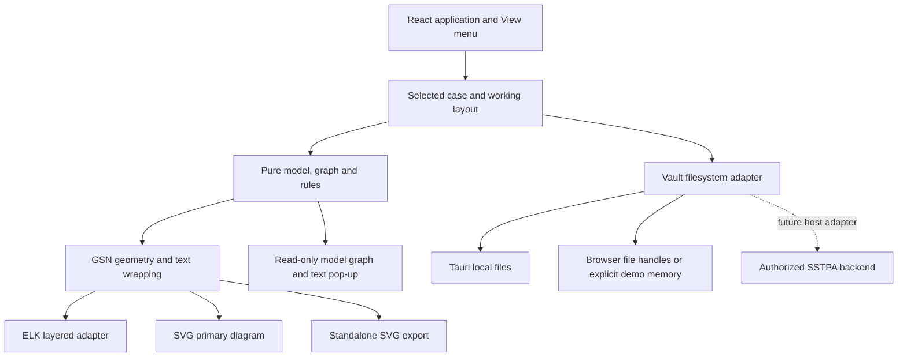

# GoalKeeper standalone architecture

Version 1.0 | 2026-10-04 | Companion: `SRS_GoalKeeper.md` v1.0

This architecture replaces v0.2's KerML-primary canvas and Cytoscape/fcose direction. The current user instruction authorizes the revised SRS, verification procedures and implementation in that order. The SRS defines required behavior; the development report identifies the observed implementation and qualification state.

## 1. Design decisions

| Concern | Decision and reason |
|---|---|
| Primary presentation | GSN v3 core symbols and arrows; notation takes precedence over inherited KerML styling |
| Diagram renderer | SVG rendered by React; shared geometry/text layout for live view and exported figure; selectable text and explicit circle/oval/parallelogram geometry |
| Layout manager | ELK layered engine, same engine family as the Loss Tool prototype; layout consumes measured node boxes rather than imposing fixed cards |
| Alternate graph/model text | Read-only illustrative projection in a View-menu pop-up; no permanent model column; explicit language-conformance limitation |
| Desktop shell | Existing Tauri 2 shell, React 18, TypeScript, Vite and Zustand |
| Semantic authority | Markdown vault with stable frontmatter and Obsidian wikilinks |
| Presentation authority | Working positions in memory; `_layout.json` written by explicit Save Layout |
| Integration | Pure semantic/rule/geometry modules and replaceable storage/host boundary; no live SSTPA backend dependency |
| Visual identity | Ivory/navy/teal/gold theme direction and subtle Art Nouveau chrome; none inside GSN symbols |
| Evidence | Local source/provenance notes referenced by Solutions; validity of a link never implies evidence sufficiency or regulatory acceptance |

The GSN profile excludes pattern/template abstractions, modular/away notation, Assurance Claim Points and dialectic/defeat extensions. Full-case SVG retains the complete argument. Labeled selected-branch previews and storyboard excerpts are partial views; optional off-diagram continuation symbols are not claimed implemented.

## 2. Runtime boundaries

The semantic graph contains no renderer objects, DOM nodes, React state or ELK internals. The layout document does not decide whether a node or relationship exists. Core modules can be exercised without the desktop shell. The SVG renderer and ELK consume the same dimensions so long text cannot overflow a symbol whose layout assumed a smaller box.

## 3. Module responsibilities

| Boundary | Responsibility |
|---|---|
| `src/core/model/` | GSN/Evidence types, identifiers, persisted provenance and layout contracts |
| `src/core/rules/` | Exact Table 1:2-2 matrix, duplicate prevention, type legality, root/identifier/reachability/evidence diagnostics |
| `src/core/graph/` | Bounded reachability and cycle analysis, including shared support |
| `src/core/markdown/` | Stable frontmatter and wikilink parse/serialize; preserve supported source provenance rather than inventing production IDs |
| `src/core/vault/` | Loading/indexing elements and evidence; canonical evidence-note resolution |
| `src/core/layout/` | Explicit hierarchical arrangement and merge of saved/manual positions with new nodes |
| GSN presentation core | Symbol geometry, content-aware dimensions, full statement wrapping, boundary connections, SVG figure export |
| `src/core/export/` | Structured Markdown/JSON case/evidence exports; illustrative model projection text |
| `src/features/structure/` | SVG interaction, pan/zoom/fit, selection/drag, optional inspector, modal alternate view |
| `src/features/wizard/` | Optional Six-Step coaching that applies only explicit author proposals |
| `src/state/` | Graph operations and dirty/layout state; reject invalid relationship candidates before mutation |
| `src/lib/fs.ts` | User-selected vault adapters, relative-path validation, read/write failure propagation and native per-file replacement |
| `src/styles/` | Shared light/dark tokens, legible text, unobtrusive chrome and focus states |

Concrete presentation filenames are recorded by the implementation/report. Component placement does not change the required interface separation.

## 4. GSN semantics and validation

The permitted matrices are deliberately smaller than the old SSTPA exception:

| Relationship | Sources | Targets |
|---|---|---|
| SupportedBy | Goal | Goal, Strategy, Solution |
| SupportedBy | Strategy | Goal |
| InContextOf | Goal, Strategy | Context, Assumption, Justification |

The mutation path checks endpoint existence/type, duplicates, root linkage and cycle creation before updating the graph. Imported invalid data remains inspectable with diagnostics, including legacy Strategy→Solution edges; the application does not synthesize a claim to repair the graph automatically. Exactly one Goal root per standalone case is a product constraint. Shared support is valid. Evidence links are external references attached to Solutions, not core GSN support edges.

Findings carry code, severity, affected ID and actionable explanation. Structural errors differ from incomplete evidence and explicitly undeveloped branches. Saving a draft does not prove that its claims are supported; customer reports preserve open evidence and acceptance gaps. Assertions about independent tests, operational measures or regime approval require actual source evidence.

## 5. Geometry, text and layout

The renderer draws a rectangle, parallelogram, true circle, rounded-ended Context, and A/J-marked ovals. Goal/Strategy undeveloped state produces a hollow diamond below the symbol. Support arrows have filled heads; context arrows have hollow heads directed toward their contextual targets. Neither a type-colored card nor a dashed context line substitutes for these symbols.

Full statement text wraps inside a shape-safe interior. Circle and ellipse text columns account for narrowing near the top/bottom; long tokens need splitting or width expansion. Text size stays at least 14 CSS pixels at diagram zoom 100%; the implementation targets 16. Zoom-to-fit is a navigation convenience, not evidence that an arbitrarily large graph is readable on one small screen. Reviewers can zoom to a legible level; the SVG retains full text at scalable resolution.

ELK receives actual node dimensions and runs a top-down layered arrangement on explicit Arrange. A stable request/version token prevents a late asynchronous layout result from overwriting newer edits. Existing manual and saved positions survive non-layout operations. New nodes receive finite, non-overlapping placement; Last Saved combines extant saved positions with placement of newly introduced nodes and drops stale positions. The layout module remains usable independently from React.

Saved coordinates retain their documented anchor convention. If a renderer change requires conversion from a former node-centre convention to an upper-left convention, perform that conversion explicitly or version the layout rather than silently shifting old files. Source examples can carry new layouts generated by the current engine.

## 6. Screen and pop-up behavior

The primary Structure canvas takes at least 80% of usable workspace width at 1440×900 when auxiliary panels are closed. An inspector can open for authoring without making the model projection permanent. The View menu opens an accessible dismissible pop-up containing the alternate graph and model text. Focus enters the pop-up, Tab stays within its controls, Escape closes it and focus returns to the invoking control.

Both views derive from the same current argument. The pop-up is a projection rather than a second editable model. Model text is labeled illustrative unless validated against an actual SysML/KerML parser and profile. Full G2M/M2G editing is future SSTPA integration work. This boundary avoids claiming that a graphical resemblance implements a standard language translator.

Light and dark themes use the same notation. Statement text contrast is at least 4.5:1; meaningful outlines/arrowheads at least 3:1. Theme accents and botanical flourishes stay in chrome outside diagrams. A status border supplements a shape or textual finding; color alone does not determine the meaning of a GSN element.

## 7. Persistence and filesystem boundary

The vault retains a root-directory-per-case organization with GSN Markdown notes, optional shared `Evidence/` notes and `_layout.json`. Semantic Save and Save Layout are separate actions. Unknown supported scalar/array provenance fields are retained through a round-trip; unsupported complex YAML is reported or preserved according to parser capabilities rather than silently represented as fully supported YAML.

Native reads and writes use the user-selected vault as their base and reject absolute/traversal paths before reaching the filesystem. Native file replacement writes a temporary file and renames after completion. The browser File System Access adapter uses writable commit/close semantics. The demo-memory adapter is explicitly a demonstration environment, not proof of native persistence. A failed read/write is surfaced; a partial scan must not be presented as a successful complete vault load.

Atomic replacement of one file is not a transaction across all case files. Power-loss durability, concurrent writers, symbolic-link escape protection and full multi-file rollback need separate design and native qualification; no claim of such qualification is made by this architecture. The future SSTPA adapter uses the host's authorized transactional commit API. Source repositories and source artifacts are read-only; only GoalKeeper is developed here.

## 8. SSTPA integration mapping

The table is an integration contract, not a claim that a live adapter is shipped.

| Standalone concept | SSTPA destination | Adapter responsibility |
|---|---|---|
| `GsnGoal`, `GsnStrategy`, `GsnContext`, `GsnAssumption`, `GsnJustification`, `GsnSolution` | Corresponding Core labels, SRS §6.5.11.6 | Preserve semantic type and statement; retain host IDs separately from local GSN IDs |
| Local root and source Asset/Loss provenance | Asset `HAS_GOAL`, associated Loss context, §6.5.11.13 | Resolve authoritative Asset/Loss/SoI identity; never promote prototype-local IDs to Core HIDs |
| `supported_by` | `SUPPORTED_BY` | Apply strict GSN matrix and host authorization; resolve the source SRS Strategy→Solution conflict before production integration |
| `in_context_of` | `IN_CONTEXT_OF` | Preserve target roles and host semantic validation |
| Solution evidence note | `HAS_VALIDATION`, `HAS_VERIFICATION`, `HAS_LOSS` | Map only evidence with authoritative kind/ID; retain other documents as reference material pending schema decision |
| Evidence artifact URI/path and source fields | Host evidence metadata/reference records | Preserve provenance and access policy; a note link is not proof that external artifact content has been audited |
| `_layout.json` | Root `GoalStructure` or future common DiagramView, §6.5.11.9 | Version/anchor conversion, stale-ID reconciliation and host transaction policy |
| Markdown semantic Save | Staged host mutation/commit, §6.5.11.21 | Replace file adapter with authorized revision-aware API; server revalidates all writes |
| Pure GSN renderer | Goal Keeper tool surface | Mount component with active theme tokens and case DTO; no ornament that changes GSN symbols |
| Model projection pop-up | Host G2M view, §3.7.5–7 | Replace illustrative generator with parser-verified profile output before advertising language interchange |
| Selection/events | Data Drawer and cross-tool navigation, §6.5.11.18 | Map host node IDs; preserve active SoI and enforce read/edit authority |

SSTPA currently maps its GSN nodes to KerML-profile features and support/context relations to profile connectors (§3.7.5–6). That storage/interchange mapping does not dictate the primary GSN canvas geometry. A future integration can preserve backend mapping while using this presentation.

## 9. Export and FireSat example

The same shape/text contract supplies primary canvas and standalone SVG. Markdown/JSON include typed nodes, edges, statements and evidence references. Export tests compare model values and reopened output, not merely file existence.

The FireSat example is derived from the prototype Loss Tool's documented source Loss. Provenance identifies the source files, the local source Loss identity and the limitations of prototype measurements. Narrow provenance claims can be supported by source notes; operational mitigation claims remain explicitly undeveloped without independent verification evidence. The storyboard follows goal, context, strategy, strategy basis, elaborated claims and evidence/reviewer presentation. It does not invent a certification outcome.

## 10. Verification and delivery

Run unit tests, TypeScript checks and production build, plus native packaging/checks where the toolchain permits. Execute the companion requirement procedures for notation, long text, light/dark contrast, manual/saved layout, keyboard pop-up, exports and source provenance. Record each requirement's PASS/FAIL/PARTIAL/NOT RUN result with evidence. Browser-only evidence does not qualify native Tauri behavior. The repository `lint` command may be an alias of type checking; report that accurately.

Deliverable records include the SRS, procedures, source disposition, quality record, example notes, development report/storyboard and verification observations. GitHub push uses the user's authorized project remote without force-pushing or modifying SSTPA Tools. Packaging or native runtime gaps, if encountered, remain visible rather than being hidden behind a passing pure-core test suite.

## Node-type color contract (SRS 1.1)

`core/presentation/colors.ts` supplies `getNodeStyle(type, theme, overrides)`, `parseNodeStyles(unknown)` and advisory `contrastRatio`. `GsnNodeStyle` has Loss-compatible `font`, `box`, `line` and `border` channels; `GsnNodeStyles` is a partial map over the six GSN types. Each stored override is a complete four-channel hexadecimal RGB style. Missing types use the active theme defaults; custom types use their selected colors in both themes. Unknown types, partial styles and arbitrary CSS values are discarded.

`LayoutDoc.display.nodeStyles` stores presentation only. Zustand keeps the working map separately from the saved sidecar; only Save Layout writes it, and Last Saved restores it. The shared `renderDiagram` and `exportSvg` accept `options.nodeStyles`, falling back to the saved sidecar when omitted; passing `{}` explicitly selects defaults. Primary canvas, model projection and SVG export use the same working map. Outgoing connectors and arrowheads use their source type's line color. Hollow context heads and undeveloped diamonds keep the canvas fill; A/J marks outside their symbol use theme ink. Standard geometry and semantic data remain unchanged.

The native dialog applies choices immediately, matching the Loss Tool selector. Contrast feedback is advisory; user-selected palettes can reduce legibility. Reset clears overrides and returns all types to the current theme defaults.
